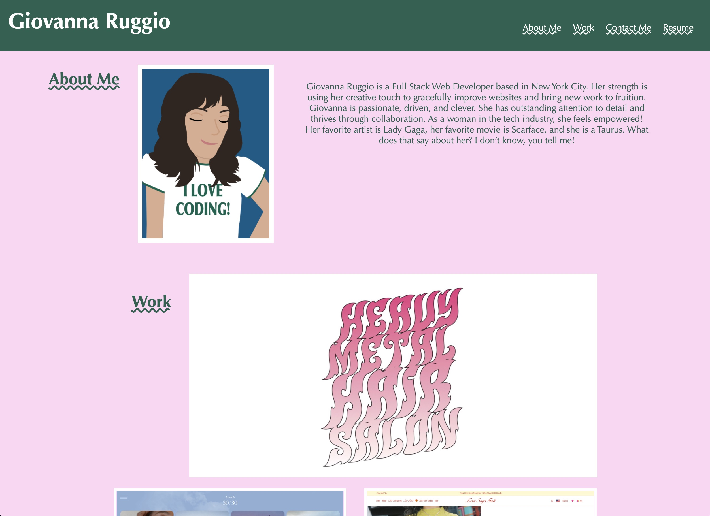
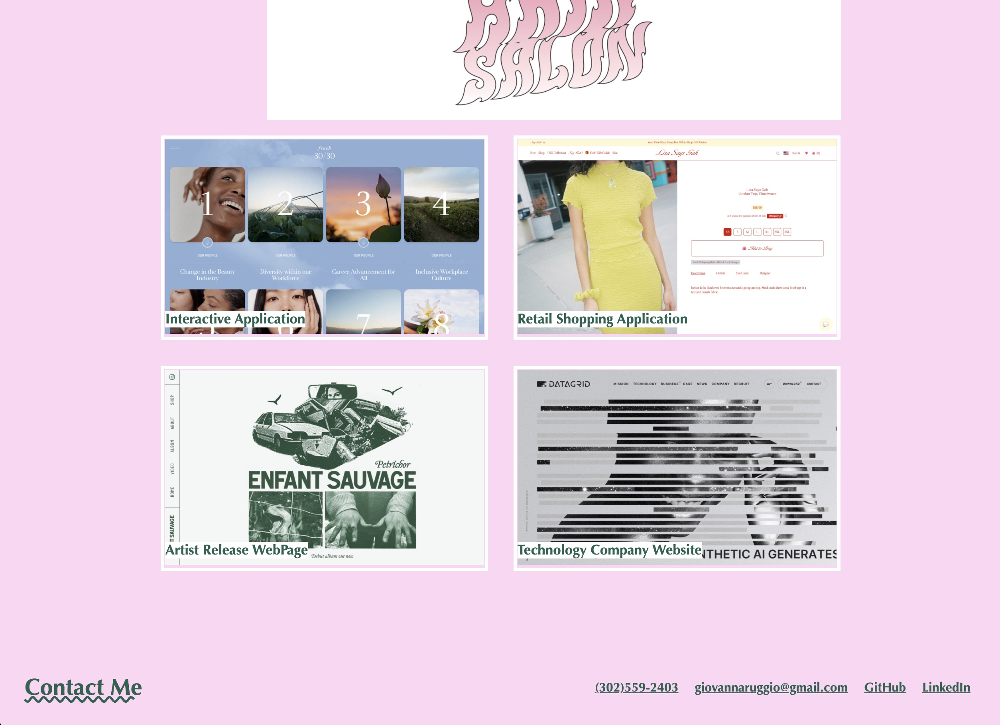
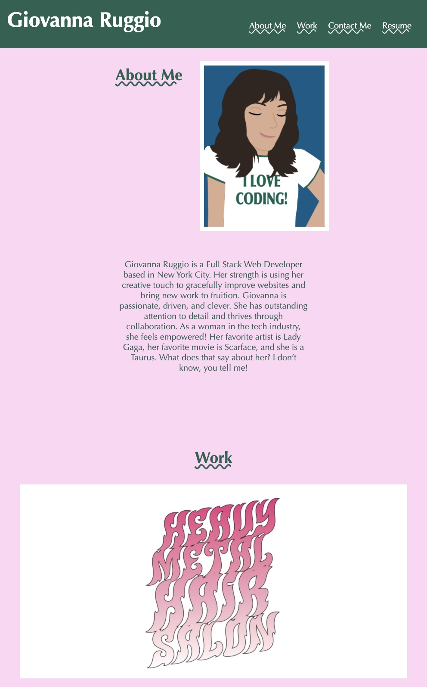
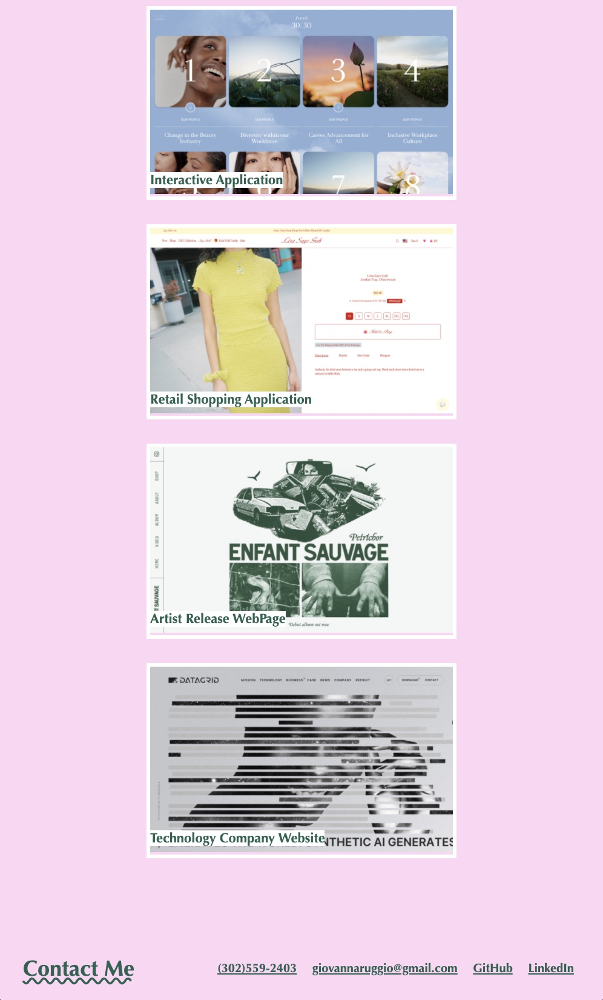

# Portfolio-Giovanna Ruggio

## Description

This project includes an prototype of my future digital portfolio. The website includes an avatar of myself as well as a short biography. It includes my contact information and links to my resume and professional profiles. Lastly, it showcases work that I am inspired by. This project is funcational, accesible, and can adapt to the user's viewport.

## Visuals

## Links

Link to Repository : https://github.com/giovannaruggio/portfolio-giovanna-ruggio

Link to Deployed Application : https://giovannaruggio.github.io/portfolio-giovanna-ruggio/